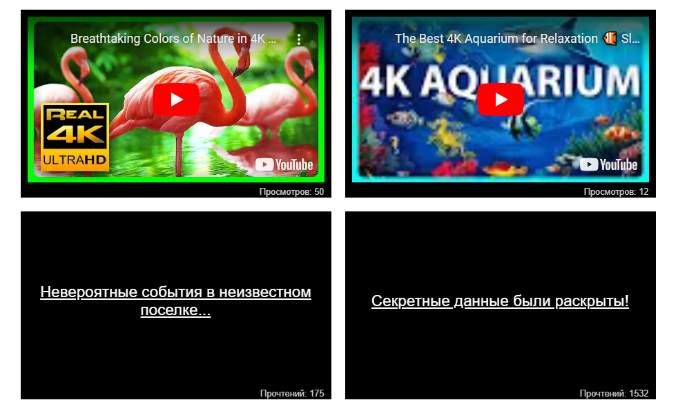

# Подсвечивание блоков

Учебный проект курса [React для JS-разработчиков](https://netology.ru/programs/react)

## **Задача**

На сайте есть блоки со статьями и с видеозаписями:

Необходимо улучшить отображение блоков таким образом, чтобы популярные статьи и видео, у которых 1000+ прочтений или просмотров, оборачивались в компонент Popular, а с количеством до 100 — в компонент New. Эти компоненты будут менять внешний облик блоков, привлекая внимание посетителей.

## **Реализация**

В ходе выполнения использован HOC, обернуты `Video` и `Article` таким образом, что при отображении в компоненте `List` они помещаются внутрь требуемого компонента `Popular` или `New`.
## **Стек технологий**

## [**Демо**](https://highlight-lemon.vercel.app/)

